# Praktikum-4
Semua Latihan pada Praktikum 4

**(Pertemuan 7)**

**Lab 2 : Struktur Kondisi**

**Latihan 1**

Buat program sederhada dengan input 2 buah bilangan, kemudian tentukan bilangan terbesar dari kedua bilangan tersebut
menggunakan statement *if*.

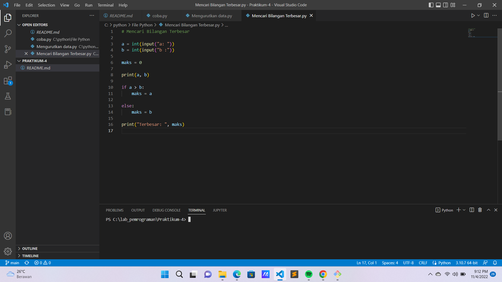

Ketika sudah muncul input , maka ketik saja :
- a = 25
- b = 50

Berikut adalah hasilnya.

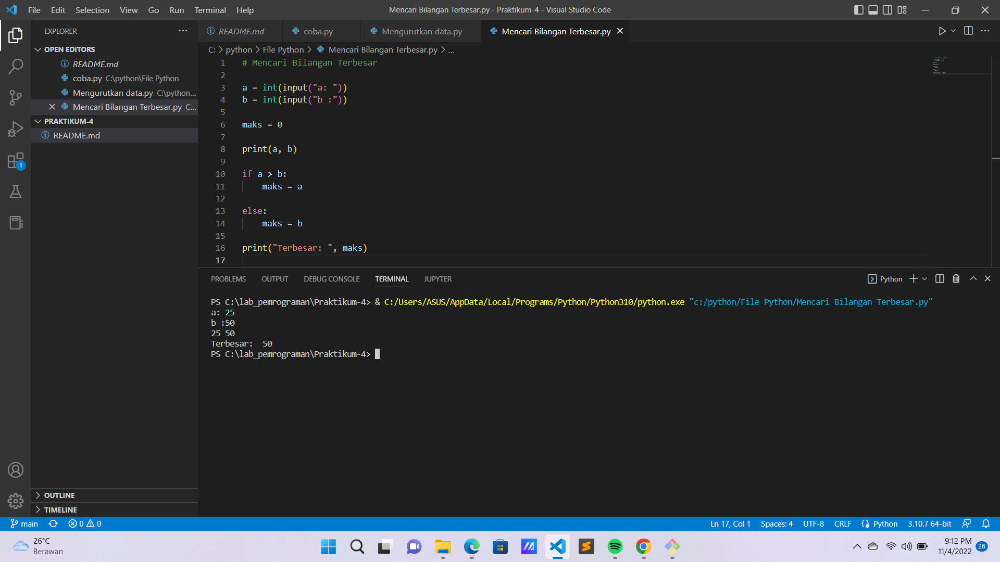

**Latihan 2**

Buat program untuk mengurutkan data , berdasarkan input sejumlah data . Secara berurutan mulai dari data yang terkecil.

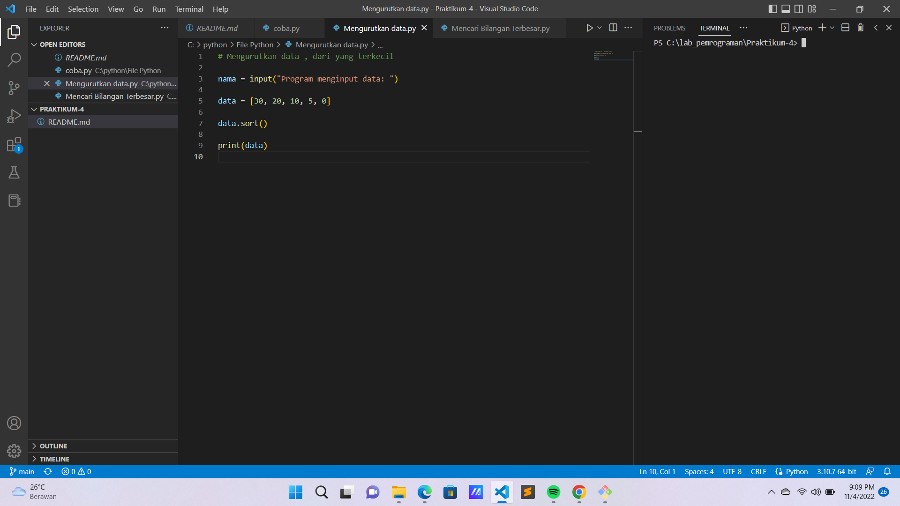

Ketika sudah muncul input , maka ketik saja angka **30.**

Meskipun kita meng-input angka 30 , tetap saja akan menghasilkan output data ber-urutan mulai dari data yang terkecil.

Berikut adalah hasilnya.

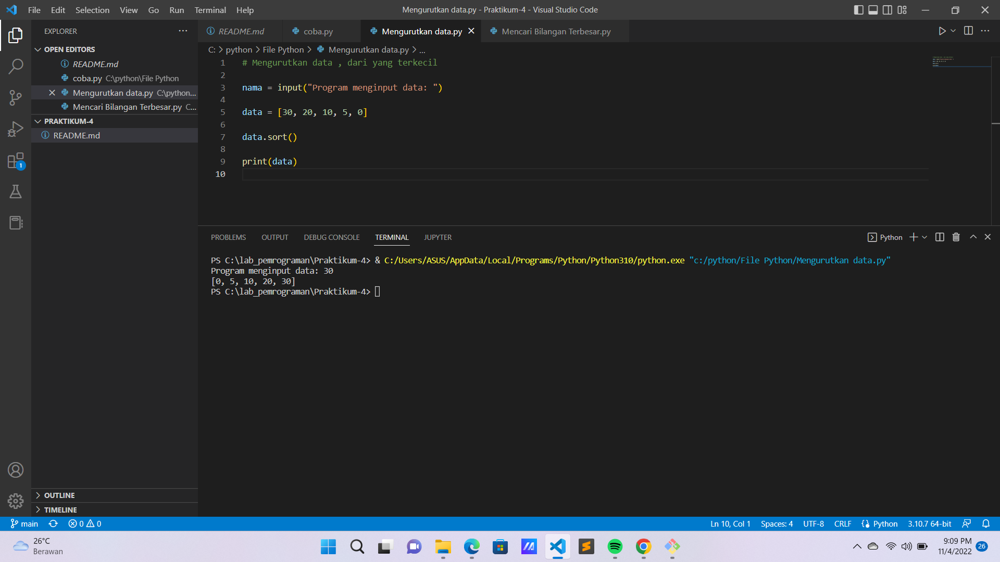

**Lab 3 : Perulangan**

**Latihan 1**

Buat program dengan perulangan bertingkat (nested) *for*.

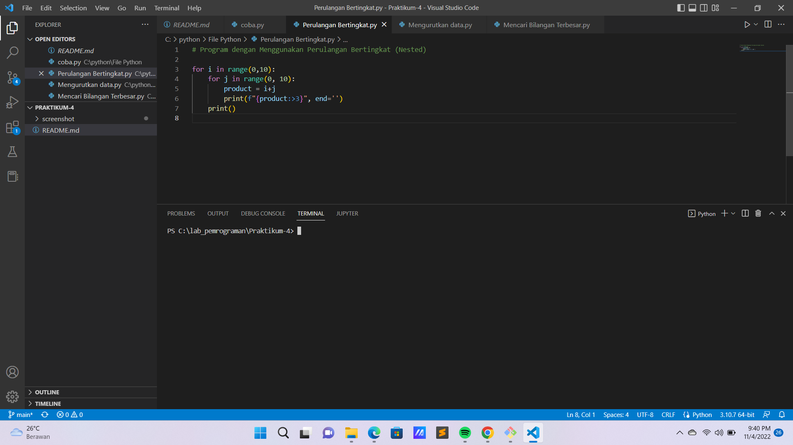

Berikut adalah hasilnya.

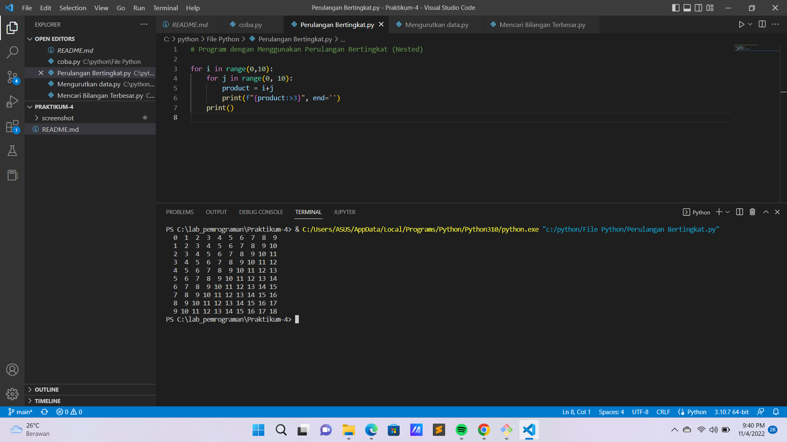

**Latihan 2**

Tampilkan n bilangan acak yang lebih kecil dari 0.5

Nilai n diisi pada saat runtime

Berikut kode program nya :

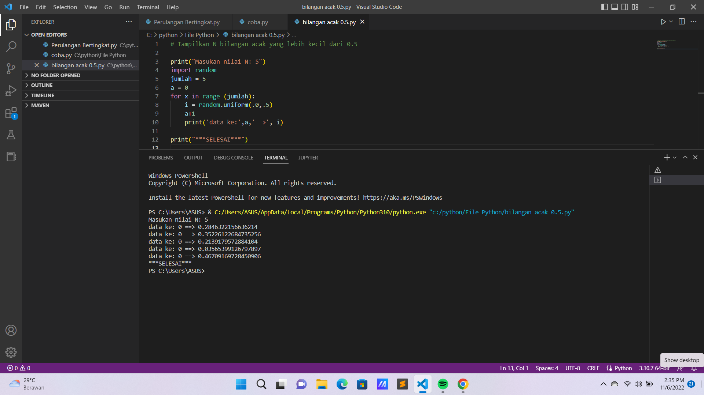

Akan menghasilkan seperti ini :

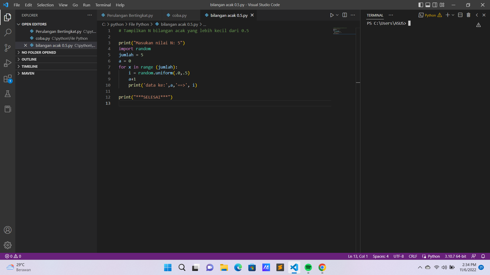

**Latihan Modul Praktikum 3**

1. Buat program sederhana dengan perulangan:

Seorang pengusaha menginvestasikan uangnya untuk memulai usahanya dengan modal awal 100 juta, pada bulan pertama dan kedua belum mendapatkan laba. pada bulan ketiga baru mulai mendapatkan laba sebesar 1% dan pada bulan ke 5, pendapatan meningkat 5%, selanjutnya pada bulan ke 8 mengalami penurunan keuntungan sebesar 2%, sehingga laba menjadi 3%. Hitung total keuntungan selama 8 bulan berjalan usahanya.

Berikut merupakan kode program nya.

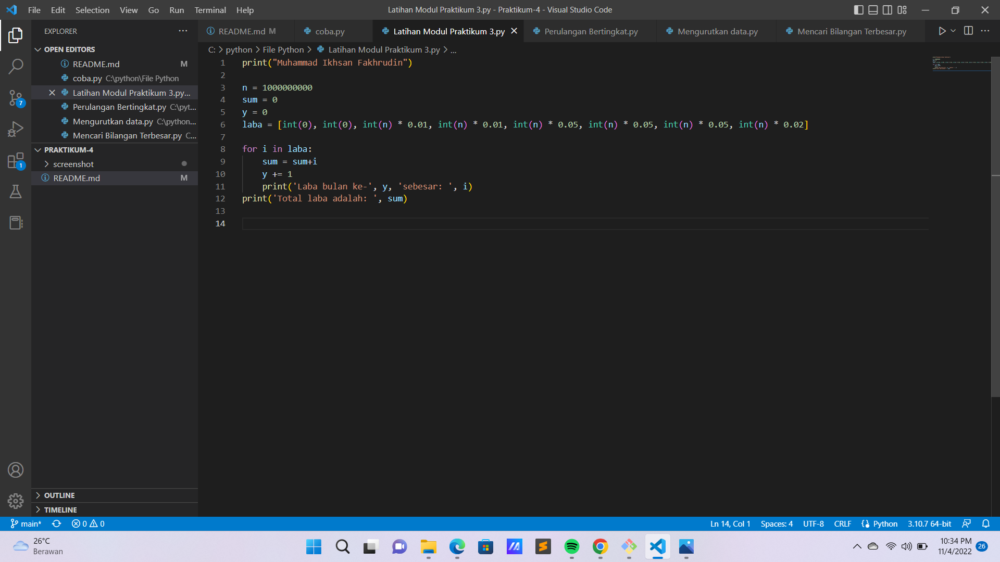

Inilah hasilnya.

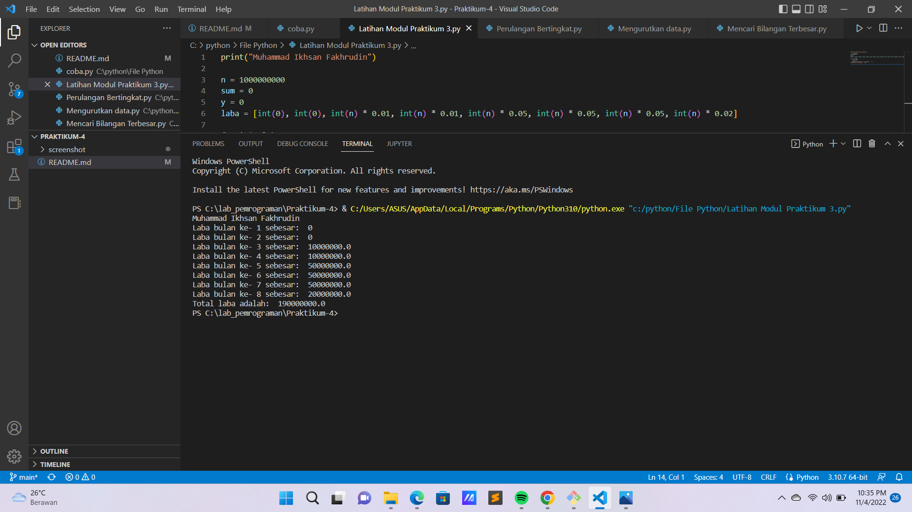

2. Buat program untuk menampilkan bilangan terbesar dari n buah data yang diinputkan. Masukkan angka 0 untuk berhenti.

Berikut merupakan kode program nya.

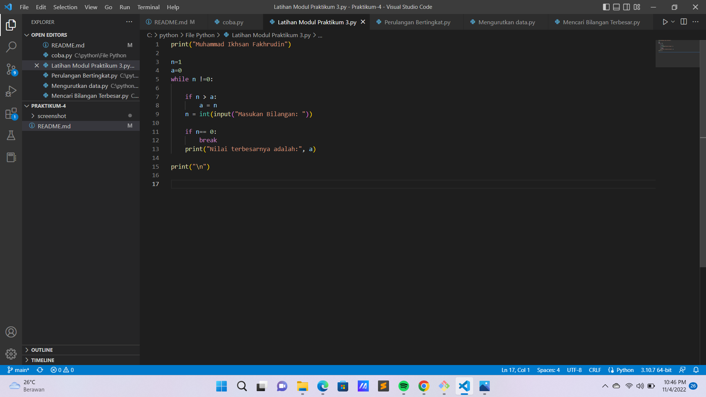

Inilah hasilnya.

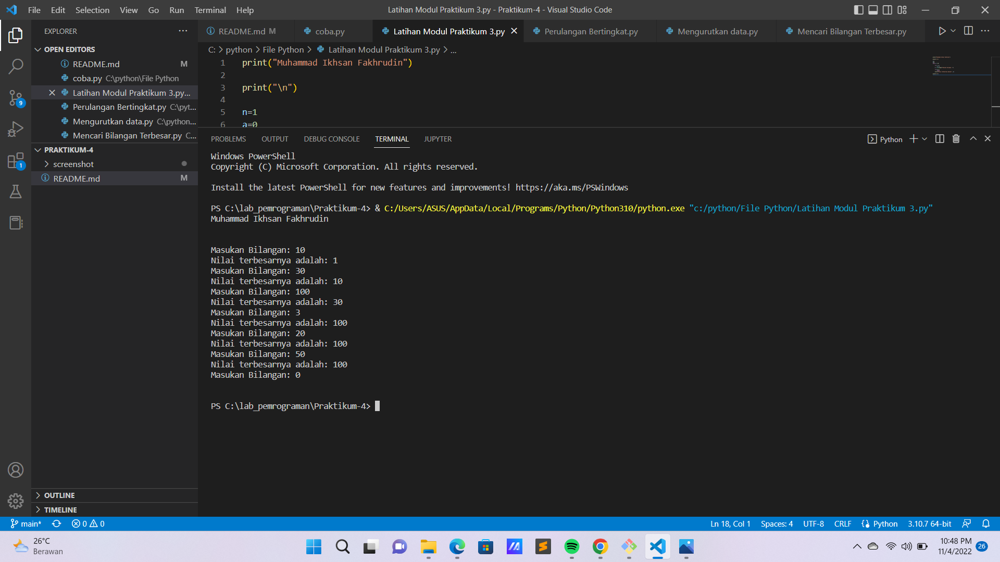

